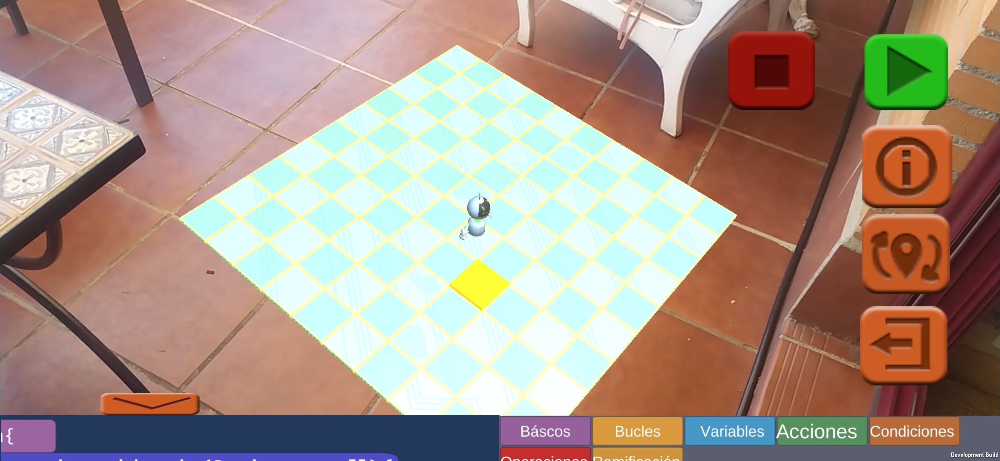
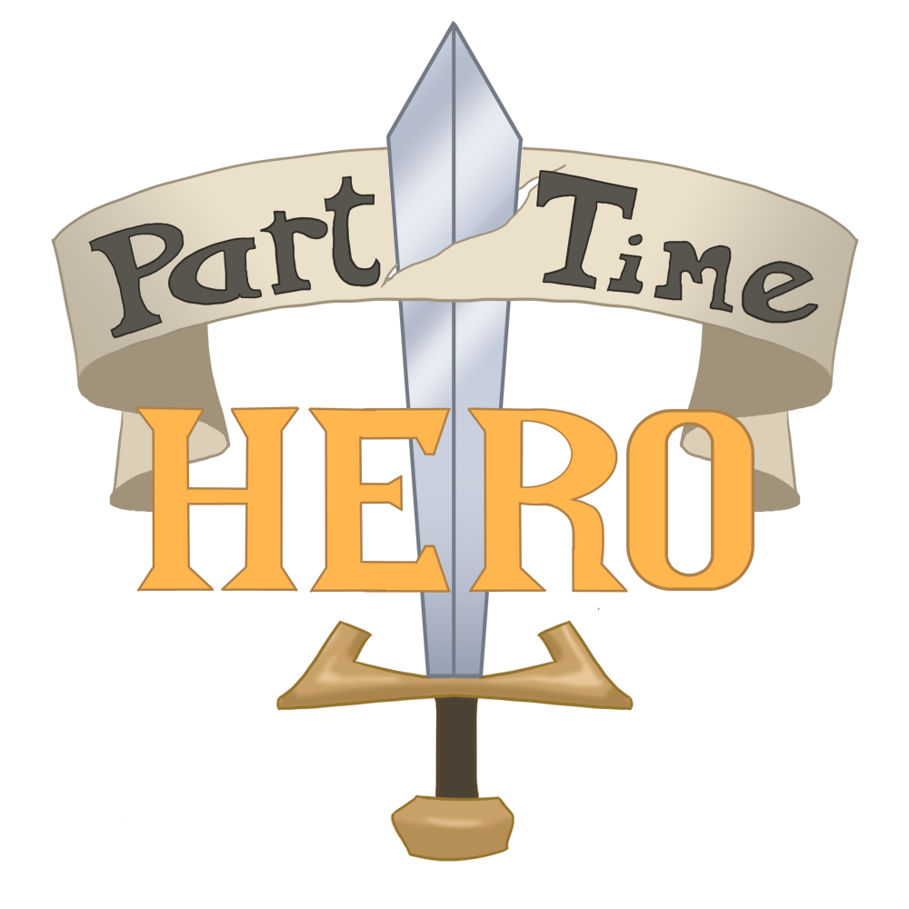
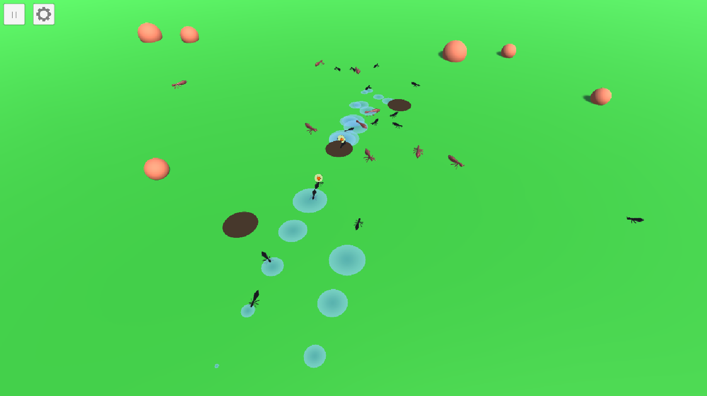
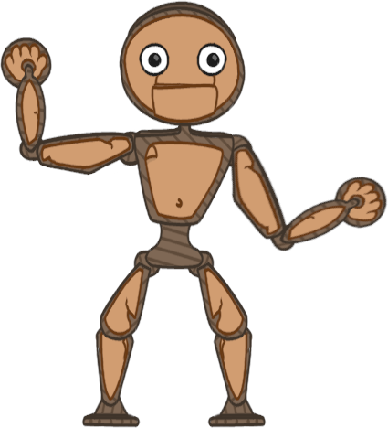
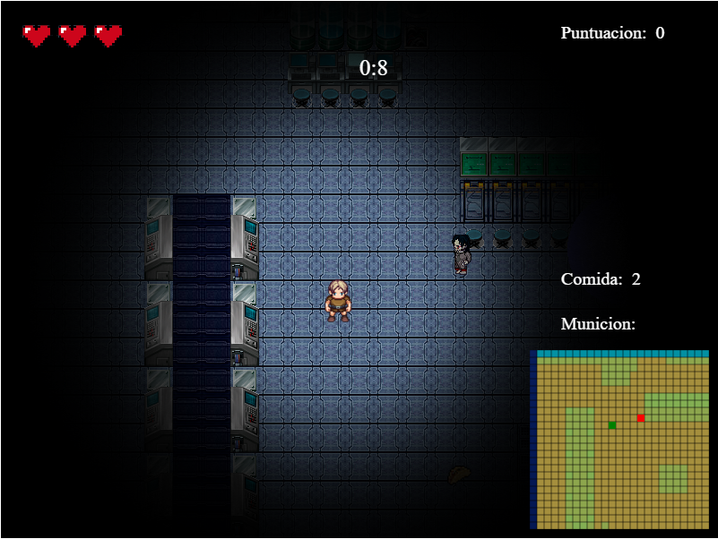

# Adrián Poza Guillermo

Videogame developer.

## About me

I studied a degree in videogame design and developement and a masters course in computer graphics, games and VR. My passion is gameplay, AI and graphics programming together with anything that is a challenge. When I'm not in front of a computer, I enjoy developing my skills in visual art and music. I hope you find my projects interesting!

## Games

### Personal Projects:

#### Code Defender:

I used to love making little games in blocks based programming languages like Scratch back when that was the best I knew. I believe it is a great way to start programming at any age. The greatest drawback is that you aren't learning a language that's actually used in the real world. That's why I created Code Defender as part of my Undergraduate Thesis Project. Code Defender is an Augmented Reality game where you control a little robot using a block based version of Java in order to beat each one of the 60 different levels, where the player will learn gradually the fundamentals of programming in Java.

- [GitHub](https://github.com/apozag/code-defender)
- [YouTube Demo](https://youtu.be/mWUIAKRr1v0)

### Projects I took part in:

#### Part-Time Hero

Multiplayer and singer player game. It is a competitive team game where the player will have to cooperate with his/her pertner to manufacture a series of orders from the resorces provided by the conveyor belts. This resources and some of the tools are shared across all the players so... keep an eye on your stuff! Anything goes as long as you win: from stealing and sabotaging to casting monsters from beyond and other crazy powerups.

- [Itch.io](https://c404games.itch.io/part-time-hero)
- [GitHub](https://github.com/C404Games/part-time-hero)
- [Demo Youtube](https://youtu.be/MZvVRqupm40)
- 
#### AntNest:

This project has a very self-explainatory name. We used behaviour trees and other techniques to conduct an anthill from its beginning all the way to becoming a huge colony with multiple anthills. The user can switch between different views and tweak settings that affect the environment.

- [BitBucket](https://bitbucket.org/VictorGonzalezRivera/antnest/src/master/)
- [Youtube Demo](https://youtu.be/jki-VikbtBE)

#### Pappets:  

2D physics based platform game where you control a string puppet in a peculiar paperboard world. 3 different levels will test skill as a pupeteer to prove that you are worthy of joining the Great Show. Try the WebGL or the Android version from itch.io .

- [itch.io](https://glassbeard.itch.io/pappets)  
- [GitHub](https://github.com/GlassBeardTeam/Puppet)  

#### Good Product Sorter:  

Humouristic arcade game. Do you dream of becoming a presigious product sorter? Of course you do! Try your best and you might get to be employee of the month this time.

  
- [itch.io](https://glassbeard.itch.io/goodproductsorter)  
- [GitHub](https://github.com/GlassBeardTeam/GoodProductSorter)  

#### DLabyrinth:  

Multiplayer battle royale game in which the player must find weapons, ammo, and other resources to survive. The different areas of the game will become unavailable every number of minutes to keep thigs more interesting.

  
- [GitHub](https://github.com/MRxRafi/DLabyrinth_JeR)  

Take a look at my [GitHub](https://github.com/apozag) and my [cuenta de YouTube](https://www.youtube.com/channel/UCClrFZQZYE2P-3rf0DiNNRQ) for more.  
