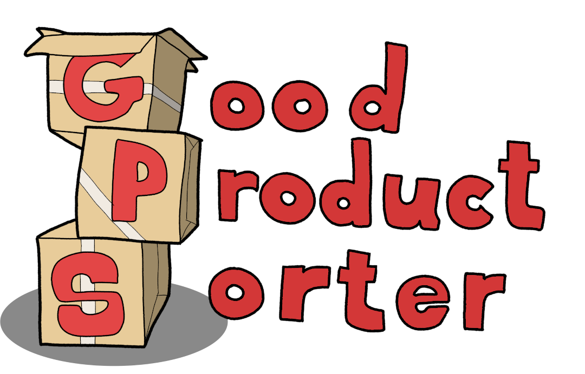

## Portfolio Adrián Poza

Desarrollador de Videojuegos 

### Proyectos

Proyectos en los que he participado.

Pappets:

- [itch.io](https://glassbeard.itch.io/pappets)
- [GitHub](https://github.com/GlassBeardTeam/Puppet)

Good Product Sorter

- [itch.io](https://glassbeard.itch.io/goodproductsorter)
- [GitHub](https://github.com/GlassBeardTeam/GoodProductSorter)

DLabyrinth

- [GitHub](https://github.com/MRxRafi/DLabyrinth_JeR)

Pásate por mi [GitHub](https://github.com/apozag) y mi [cuenta de YouTube](https://www.youtube.com/channel/UCClrFZQZYE2P-3rf0DiNNRQ) para ver más.
